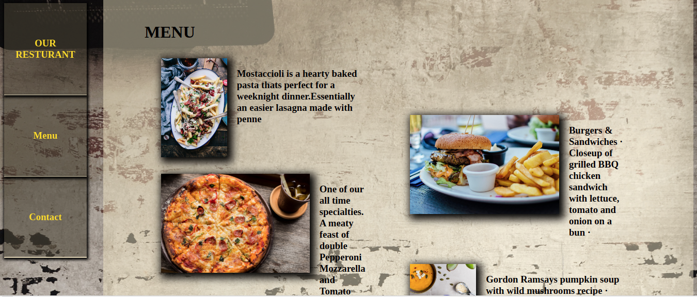

# Romero Resturant



> The main objective for this application is to test the ability to bulid tabs navbar ,  and to do DOM manipulation.


## Built With

- HTML
- JavaScript
- css

## Live Demo

[Live Demo](https://sleepy-feynman-40ee54.netlify.app/)


### Getting Started
> Open Terminal
```
git clone git@github.com:sanadwj/restaurant-page.git
```
> Run `index.html` in your favorite browser.


### Deployment

This project has been deployed on Netlify.


## Author


👤 **Sanad Abujbara**

- Github: [@sanadwj](https://github.com/sanadwj)
- Twitter: [@sandooog](https://twitter.com/sandooog)
- Linkedin: [sanad-abujbara](https://linkedin.com/in/sanad-abujbara)
- Portifolio: [sanadabujbara.tech](https://sanadabujbara.tech)

## 🤝 Contributing

Contributions, issues and feature requests are welcome!

## Show your support

Give a ⭐️ if you like this project!

## Acknowledgments

- Microverse
- GitHub
- TheOdinProject
- JavaScript